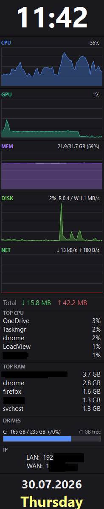

# LoadView

[](https://github.com/Jimmy20/LoadView/releases/latest)
[](https://github.com/Jimmy20/LoadView/releases)
[](LICENSE)


<table>
<tr>
<td valign="top">
<p><strong>Task Manager's performance graphs, pinned to the corner of your screen.</strong>
LoadView is a lightweight, always-on-top overlay showing live <strong>CPU, GPU, RAM, disk and
network</strong> graphs — plus temperatures, per-drive usage, top processes, a clock and your IP —
as a <strong>single portable <code>.exe</code></strong>. No install, no dependencies.</p>
<p><em>A tiny, portable alternative to Rainmeter, Sidebar Diagnostics and heavyweight monitoring suites.</em></p>
<p><strong>⬇ <a href="https://github.com/Jimmy20/LoadView/releases/latest">Download the latest release</a></strong> &nbsp;·&nbsp; Windows 10/11 &nbsp;·&nbsp; free &amp; open-source</p>
<h3>Highlights</h3>
<ul>
<li><strong>Everything at a glance</strong> — live CPU / GPU / RAM / disk / network graphs, plus <strong>session data-transfer totals</strong> (downloaded / uploaded), top-5 CPU &amp; RAM processes, and a clock, date &amp; weekday.</li>
<li><strong>Drives &amp; IP</strong> — per-drive usage bars with free space, <strong>including mapped network drives</strong>, plus your <strong>LAN and public (WAN) IP</strong>.</li>
<li><strong>Temperatures for every GPU</strong> (NVIDIA / AMD / Intel, no driver needed) plus an <em>optional</em> accurate CPU temperature that <strong>works even with Windows Memory Integrity turned on</strong>.</li>
<li><strong>Vendor-neutral &amp; DPI-agnostic</strong> — the same counters Task Manager uses; crisp at any scaling; remembers its position per screen resolution.</li>
<li><strong>Fully configurable</strong> — resize, reorder or hide any section; per-graph colours, max &amp; red alerts; MB/s or Mbps; °C/°F; opacity; always-on-top or coverable; lock.</li>
<li><strong>Single portable exe</strong> — one <code>LoadView.exe</code>, no install and no dependencies; runs on any Windows 10/11 PC.</li>
</ul>
</td>
<td valign="top" width="260">

</td>
</tr>
</table>

## Build

Requires nothing beyond a stock Windows 10/11 (uses the in-box .NET Framework compiler).

```powershell
./build.ps1
```

This produces `bin\LoadView.exe`.

## Run

```powershell
./bin/LoadView.exe
```

- **Drag** anywhere on the panel to move it; the position is saved **per screen resolution**
  (each display layout remembers its own spot and is restored when you return to it).
- **Right-click** the panel (or the tray icon) for: *Lock*, *Always on top*, *Refresh WAN now*,
  *Reset position*, *Settings…*, *Contact me*, *About*, *Exit*.
- **Left-click the tray icon** to bring the overlay to the front (even in background mode).

All settings are stored in `%APPDATA%\LoadView\settings.ini` (delete it to reset to defaults).

## Settings

Right-click → **Settings…** opens a dialog with a **category sidebar** on the left; picking a
category shows its options on the right. Changes **preview live on the overlay** as you make
them — **OK** keeps them, **Cancel** reverts. Categories:

- **Layout** — window width, graph height (applies to all graphs), drive-bar height, refresh
  interval.
- **Sections** — a checklist that controls both **visibility** (the checkbox) and **order**
  (the ▲▼ buttons) for every section: clock, each graph, net totals, top CPU, top RAM,
  drives, IP, date/weekday.
- **Graphs** — per graph: accent **color**, **max** (0 = auto / 100% default), and a red
  **alert** threshold (e.g. CPU ≥ 90 turns the whole graph red; 0 = off). The network max is
  in the selected unit.
- **Clock & date** — show-seconds; size + colour for clock/date/weekday; **bold** toggles for
  date and weekday.
- **Drives & lists** — drive-label size + bold; Top CPU/RAM text size; IP text size.
- **Network** — unit (**MB/s** bytes or **Mbps** bits); **download / upload colours** (default
  green / red); net-totals text size; **LAN / WAN IP refresh** intervals (seconds); **show WAN
  country** and **flag** under the public IP (off by default).
- **Behavior** — opacity; *Always on top*; *Lock position*; show external IP; **Start with
  Windows**; **write debug log**.
- **Defaults** — *Save current as defaults* writes your config to `defaults.ini`; *Reset to
  defaults* restores it. When `settings.ini` is absent the app falls back to `defaults.ini`
  (then to the built-in defaults), so you can copy `defaults.ini` to other machines.

Only one instance runs at a time (launching again is a no-op).

The right-click menu order is **Lock · Always on top · Refresh WAN now · Reset position ·
Settings… · Contact me · About · Exit**. *Refresh WAN now* re-fetches your public IP on demand.
About shows the version and changelog.

## Start with Windows

Tick **Start with Windows** in Settings. It creates a shortcut in your Startup folder
(`shell:startup`) — no admin needed. (It deliberately does **not** write the `HKCU\…\Run`
key; see *Antivirus / Defender* below.)

## Antivirus / Defender

LoadView is a single **unsigned** exe, so Microsoft Defender's machine-learning heuristics may
occasionally flag a freshly-downloaded build as a **false positive** — typically
**`Trojan:Win32/Wacatac.B!ml`**, a *generic* ML "catch-all" for unknown, low-reputation
executables. The `!ml` suffix means it's a heuristic guess, **not** a signature match, and the
Microsoft encyclopedia page for it is generic family boilerplate, not an analysis of this file.
Because every new unsigned release starts with near-zero reputation, this can recur on new
versions until reputation builds up (or the exe is signed).

> An older heuristic, **`Behavior:Win32/Persistence.A!ml`**, used to trip on apps writing to
> `HKCU\…\Run`. LoadView hasn't done that since v2.4.0 — it uses a Startup-folder shortcut — so
> that one shouldn't occur on current versions.

Why it happens: the exe is **unsigned** and each release is **freshly built** (near-zero download
reputation), and the *optional* accurate-CPU-temp feature downloads and installs a driver and runs
an elevated helper — benign and **off by default**, but a pattern ML models are trained on. None of
this is malware; the binary is built by GitHub Actions from the public source in this repo.

**Verify integrity:** compare your download's hash with the release asset —
`Get-FileHash LoadView.exe -Algorithm SHA256` — or upload it to
[VirusTotal](https://www.virustotal.com/): only a couple of engines flagging it with generic/`!ml`
names is the hallmark of a false positive.

If Defender flags it:

1. **Restore / allow it**: Windows Security → *Virus & threat protection* → *Protection history* →
   allow or restore the item; optionally add a folder exclusion while testing.
2. **Report the false positive** so Microsoft clears it for everyone (free, usually 1–3 days):
   <https://www.microsoft.com/wdsi/filesubmission> — submit as *Software developer* →
   *Incorrectly detected as malware*, include the SHA-256 and a link to this repo.
3. **Reputation heals it**: as more people download the same build, the ML reputation score rises
   and the detection typically fades on its own.
4. **Sign it** (the durable fix) — see below. A signed binary with reputation is trusted; CI signs
   automatically once the signing secret is set.

## Continuous build & releases

A GitHub Actions workflow ([.github/workflows/build.yml](.github/workflows/build.yml))
builds `LoadView.exe` on every push to `main` using the in-box compiler and uploads it as an
artifact; pushing a tag like `v2.1.0` publishes a GitHub Release with the exe attached.

### Code signing (optional)

The exe is unsigned by default, so SmartScreen / some corporate antivirus may warn on first
run. Where to get a certificate:

- **Azure Trusted Signing** — Microsoft's service, ~$10/month, real Authenticode, CI-friendly.
- **SignPath.io Foundation** — free code signing for open-source projects.
- **Certum Open Source** — cheap OSS cert (USB token).
- **Commercial OV/EV** (Sectigo, DigiCert, GlobalSign, SSL.com) — ~$100–700/yr; **EV** gives
  near-instant SmartScreen reputation. (Self-signed certs do **not** help.)

To sign locally:

```powershell
signtool sign /f your-cert.pfx /p PASSWORD /fd SHA256 /tr http://timestamp.digicert.com /td SHA256 bin\LoadView.exe
```

CI signs automatically if you add repo secrets `SIGN_PFX_BASE64` (base64 of your `.pfx`)
and `SIGN_PFX_PASSWORD`; otherwise that step is skipped.

## Sections (default order, all reorderable & hideable)

| Section     | Shows                                                                 |
|-------------|-----------------------------------------------------------------------|
| Clock       | current time (`HH:mm:ss` or `HH:mm`)                                   |
| CPU         | % utilization (`· 52°C` when a temp is available)                     |
| GPU         | % of busiest GPU (`· 61°C` on NVIDIA / AMD / Intel)                   |
| MEM         | % physical RAM, e.g. `20.3/31.7 GB (64%)`                             |
| DISK        | % active time across **all** disks + `R / W MB/s`                    |
| NET         | down + up graph, in MB/s or Mbps                                      |
| Net totals  | session download / upload volume, e.g. `Total ↓ 1.2 GB  ↑ 350 MB`     |
| Top CPU     | top 5 processes by CPU (aggregated by name)                           |
| Top RAM     | top 5 processes by memory                                             |
| Drives      | per drive: usage bar (red ≥90%), used/total, **free space** on the right; includes mapped network drives |
| IP          | `LAN:` internal + `WAN:` public address, optionally with the WAN country + flag |
| Date        | `29.06.2026` then the weekday below                                   |

If a metric's counter isn't available on a given machine, that row shows `n/a` and the
rest keep working.

### Temperatures

Temperatures are **best-effort** and shown next to the CPU / GPU graphs (e.g. `47% · 62°C`).
Under **Settings → Temperatures** you can switch °C/°F, hide either temperature, and set a red
**hot** threshold.

- **GPU** is read in **user-mode from the GPU vendor's own driver library** — NVIDIA (NVML),
  AMD (ADL) and Intel (IGCL) — so it works across vendors with **no admin and no extra files**
  (nothing is bundled; the libraries ship with the graphics driver). The hottest GPU is shown.
  Very old Intel iGPUs expose no sensor and simply stay blank.
- **CPU** uses the ACPI thermal zone (WMI). Many machines — most Intel laptops included — expose
  nothing there, or report a chipset zone rather than the CPU die, so the CPU temperature is
  often blank or approximate. Reading the true per-core temperature requires a **kernel driver**,
  which LoadView keeps as an **opt-in** feature (off by default) so the default stays a portable,
  no-install, no-admin single exe.

If a temperature isn't available it is simply omitted and everything else keeps working.

#### Accurate CPU temperature (optional driver)

The true per-core CPU temperature lives in the CPU's MSR registers, which can only be read from a
**kernel driver** — there is no user-mode API for it. LoadView keeps this as an **opt-in** so the
default download stays a portable, no-install, no-admin single exe.

Enable **Settings → Temperatures → "Accurate CPU temp (driver)"** to turn it on. LoadView then offers
to set it up; you get **one administrator prompt**, and after that the temperature appears silently on
every launch — **including when your own Windows account is not an administrator**, which is the normal
case on a managed work PC. What the setup does:

- Installs **[PawnIO](https://pawnio.eu/)** — a free, open-source, **digitally-signed** sensor driver
  that is **HVCI-compatible**, so this works **even with Windows Memory Integrity turned on** (unlike
  the old WinRing0 driver, which HVCI blocks). A pinned version is downloaded from its official source
  and both the signature **and the publisher** are verified before it is run; nothing is bundled in
  `LoadView.exe`.
- Copies the reader (LoadView itself) and **LibreHardwareMonitor** (verified by SHA-256) into
  `C:\Program Files\LoadView\`, and registers a **Task Scheduler** task named
  *LoadView CPU Temp Helper* that runs it as the **SYSTEM** account on demand. SYSTEM is what makes the
  sensor readable without you being an administrator: the driver's device can only be opened by
  SYSTEM/Administrators, and a task set to "highest available privileges" gives a standard user
  nothing extra.
- The task can be **started** by any interactive user but **not modified** by one, and every folder it
  involves is locked down (`Program Files` copy and library: read-only for users; the overlay may only
  write its heartbeat into `C:\ProgramData\LoadView\in`). That combination is deliberate — a SYSTEM task
  that could run or load a file a normal user can overwrite would be a privilege-escalation hole.
- The reader publishes the CPU package temperature to the overlay through
  `C:\ProgramData\LoadView\out`. The overlay itself always stays unelevated.
- If anything fails (offline, policy, or you decline the prompt), LoadView falls back to the ACPI /
  blank reading — nothing breaks. Diagnostics: `C:\ProgramData\LoadView\out\helper.log`.

To undo all of it, run once from an administrator prompt — this removes the task and both folders
(PawnIO is deliberately left installed, since other tools may use it):

```
LoadView.exe --temp-remove
```

Leave the option **off** (the default) to stay completely driver-free and admin-free. It only affects
**CPU** temperature; GPU temperature never needs a driver.

## Notes

- Metrics refresh once per second; drives, top processes and IPs are sampled on background
  threads so a slow disk/share or web lookup never stalls the overlay.
- After resuming from sleep/hibernation the rate metrics (CPU/disk/network) briefly hold their
  last value while the performance counters re-baseline — this avoids a false 100% CPU spike.
- Disk and network values are aggregated across all physical disks / real network
  adapters (loopback and tunnel pseudo-interfaces are excluded).
- The **external IP** is fetched periodically from a public service (`api.ipify.org` over
  HTTPS); turn it off in Settings if you prefer no outbound requests. It shows `—` when offline.
  **Refresh WAN now** (right-click menu) re-fetches it on demand.
- Optionally the **WAN country + flag** can be shown under it (Settings → Network, off by default):
  the country is looked up from the IP via `ipwho.is` and a small flag image is fetched from
  `flagcdn.com` and cached in `%APPDATA%\LoadView\flags` — both only when the option is enabled.
- Reading performance counters does not require administrator rights.
